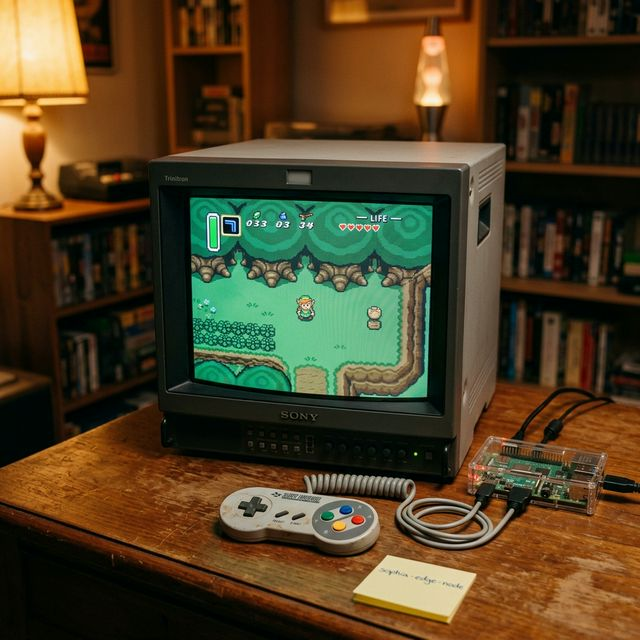

# Retro Screenshot Gallery Submission — rustchain-bounties #2322

## Setup Photo

## Brief Description & Story (Bonus Claims)
This is my childhood retro sanctuary. I rescued this heavy old CRT monitor from a local thrift store just hours before it was going to be scrapped for parts. I paired it with a Raspberry Pi 4 running RetroArch, while the `sophia-edge-node` runs quietly in the background, securing the network while I play.

The controller is my original, authentic SNES pad that I've kept safe since the 90s, adapted via USB. This setup keeps my childhood memories totally alive, bringing back the exact warm, nostalgic, vintage living room vibe from when I was a kid. Nothing beats the scanlines on real glass!

**Bonus Points Claimed:**
- ✅ CRT Monitor (Rescued from scrap)
- ✅ Original Controller (90s authentic SNES pad)
- ✅ Vintage Vibes / Story (Saved hardware, authentic childhood collection)

**Wallet:** 
`0x6a25f6195d4b739742f49a03bbe96d7649296d62a1cdbd116b7b88168be54a5d`
